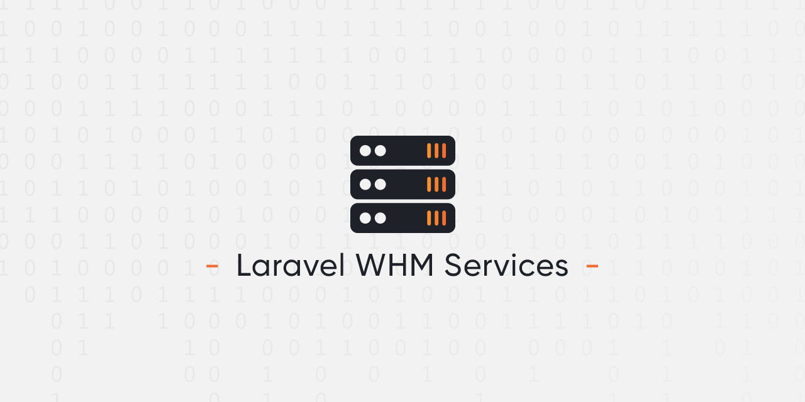

# Laravel WHM Services

Laravel WHM Services let you handle your services from the command line. You can for example restart PHP-FPM after deploying your app.

<p align="center">
    
</p>

## Installation

You can install the package via composer (the package will automatically register itself) :

```bash
composer require weblogin/laravel-whm-services
```

## Usage

```bash
php artisan whm-services:restart apache_php_fpm
```

## Configuration

You can change the default configuration declaring the corresponding variable in you environment file.

- `WHM_SERVICES_HOST` : The domain where the WHM API is accessible. The default value is your own domain (APP_URL).
- `WHM_SERVICES_PORT` : We use the WHM default port which is 2087.
- `WHM_SERVICES_API_TOKEN` : You have to generate this token via WHM > Development > Manage API Tokens. You'll need the following privileges
    - Restart command : "Restart services"

## License

The MIT License (MIT). Please see [License File](LICENSE.md) for more information.
